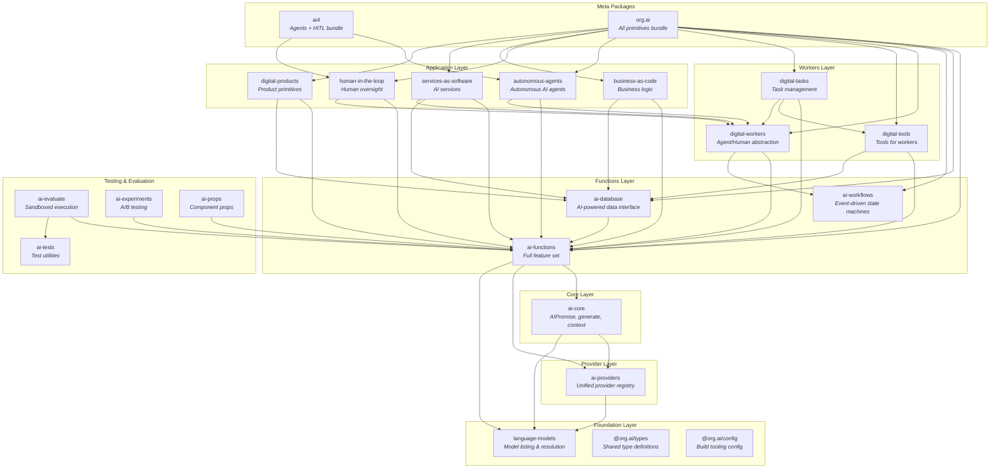

# Architecture

This document describes the high-level architecture of the primitives.org.ai monorepo, a collection of composable AI primitives for building intelligent applications.

## Overview

The primitives.org.ai project provides a layered architecture of TypeScript packages that enable developers to build AI-powered applications with:

- **Promise pipelining**: Chain AI operations without explicit awaits using `AIPromise`
- **Dynamic schema inference**: Automatically infer output schemas from property access
- **Context-aware execution**: Configuration flows through the call stack via `AsyncLocalStorage`
- **Provider abstraction**: Unified interface across OpenAI, Anthropic, Google, Bedrock, and Cloudflare
- **Batch processing**: Automatic batching for cost optimization
- **Resilience patterns**: Retry policies, circuit breakers, and fallback chains

## Package Dependency Diagram



## Package Layers

### Foundation Layer

| Package | Description |
|---------|-------------|
| `language-models` | Model listing and resolution for LLM providers (OpenRouter data) |
| `@org.ai/types` | Shared TypeScript type definitions |
| `@org.ai/config` | ESLint and TypeScript configuration presets |

### Provider Layer

| Package | Description |
|---------|-------------|
| `ai-providers` | Unified AI provider registry with Cloudflare AI Gateway support. Integrates with OpenAI, Anthropic, Google, and AWS Bedrock. |

### Core Layer

| Package | Description |
|---------|-------------|
| `ai-core` | Foundational primitives: `generate()`, `AIPromise`, template literals, and context management. Lightweight package for basic usage. |

### Functions Layer

| Package | Description |
|---------|-------------|
| `ai-functions` | Full-featured AI primitives including batch processing, retry/resilience, caching, budget tracking, and tool orchestration. Re-exports all of `ai-core`. |
| `ai-database` | AI-powered database interface with mdxld conventions for linked data. |
| `ai-workflows` | Event-driven workflows with state machine support. |

### Workers Layer

| Package | Description |
|---------|-------------|
| `digital-workers` | Common abstract interface over AI agents and humans. |
| `digital-tools` | Tools that can be used by both humans and AI agents. |
| `digital-tasks` | Task management primitives with queue support. |

### Application Layer

| Package | Description |
|---------|-------------|
| `autonomous-agents` | Primitives for building autonomous AI agents. |
| `human-in-the-loop` | Primitives for human oversight and intervention. |
| `business-as-code` | Express business logic and processes as code. |
| `services-as-software` | Build AI-powered services that operate as software. |
| `digital-products` | Define and build digital products. |

### Testing & Evaluation

| Package | Description |
|---------|-------------|
| `ai-tests` | Test utilities with Chai-based assertions via RPC. |
| `ai-evaluate` | Secure code execution in sandboxed environments (Miniflare). |
| `ai-experiments` | A/B testing and experimentation with ClickHouse storage. |
| `ai-props` | AI-powered props for intelligent component properties. |

### Meta Packages

| Package | Description |
|---------|-------------|
| `ai4` | Bundle of autonomous-agents + human-in-the-loop. |
| `org.ai` | All primitives bundled with subpath exports. |

## Key Concepts

### AIPromise

`AIPromise` is the core abstraction for promise pipelining, inspired by Cap'n Proto's RPC promise pipelining. It enables:

```typescript
// Property access tracking for dynamic schema inference
const { summary, keyPoints, conclusion } = ai`write about ${topic}`

// Pipeline without await - dependencies are tracked
const isValid = is`${conclusion} is solid given ${keyPoints}`

// Only await at the end - batch resolution happens automatically
if (await isValid) {
  console.log(await summary)
}
```

**Key Features:**
- **Dynamic schema inference**: Properties accessed on the promise are tracked and used to build the output schema
- **Dependency tracking**: AIPromises used in template literals are tracked as dependencies
- **Deferred execution**: Resolution happens when awaited, enabling batch optimization
- **Streaming support**: `.stream()` method for real-time output

### Context Management

Execution context flows through the call stack using `AsyncLocalStorage`, enabling configuration without polluting function signatures:

```typescript
// Global configuration
configure({
  model: 'claude-sonnet-4-20250514',
})

// Scoped configuration
await withContext({ model: 'gpt-4o' }, async () => {
  const titles = await list`10 blog titles`
  return titles
})
```

**Context Hierarchy:**
1. Environment variables (`AI_MODEL`, `AI_PROVIDER`, API keys)
2. Global context (via `configure()`)
3. Local context (via `withContext()`)

### Batch Processing

Two complementary batching mechanisms:

**BatchQueue** - Explicit batch operations for provider batch APIs:
```typescript
const batch = createBatch({ provider: 'anthropic' })
batch.add('prompt1', schema1)
batch.add('prompt2', schema2)
const results = await batch.execute()
```

**BatchMapPromise** - Automatic batching with recording mode:
```typescript
const items = await list`startup ideas`
const analyses = await items.map(item => ai`analyze ${item}`)
// Operations are recorded and batched automatically
```

### Resilience Patterns

The `ai-functions` package provides enterprise-grade resilience:

**Retry Policy:**
- Exponential backoff with configurable base delay and multiplier
- Jitter strategies: equal, full, decorrelated
- Error classification for intelligent retry decisions

**Circuit Breaker:**
- Fail-fast behavior after repeated failures
- Half-open state for recovery testing
- Configurable failure thresholds

**Fallback Chain:**
- Model failover (e.g., sonnet -> opus -> gpt-4o)
- Automatic fallback on errors or timeouts

```typescript
const result = await withRetry(
  () => ai`complex task`,
  {
    maxAttempts: 3,
    baseDelay: 1000,
    maxDelay: 30000,
    jitter: 'decorrelated',
  }
)
```

## Cross-Cutting Concerns

### Error Handling

Errors are classified for intelligent handling:

| Category | Description | Retryable |
|----------|-------------|-----------|
| `Network` | Connection issues, timeouts | Yes |
| `RateLimit` | Quota exceeded | Yes (with backoff) |
| `Server` | 5xx errors | Yes |
| `InvalidInput` | Bad request, validation | No |
| `Authentication` | Auth failures | No |
| `ContextLength` | Token limit exceeded | No (without modification) |

Custom error classes (`RetryableError`, `NonRetryableError`, `RateLimitError`, etc.) enable fine-grained error handling.

### Type Safety

The architecture emphasizes TypeScript type safety throughout:

- **Zod schemas** for runtime validation and type inference
- **Generic type parameters** on AIPromise for typed results
- **Strict null checks** and exhaustive pattern matching
- **Type-safe configuration** with discriminated unions

### Provider Abstraction

The `ai-providers` package provides a unified interface:

```typescript
// Provider-agnostic code
const result = await generateObject({
  model: 'sonnet',  // Alias resolved by language-models
  schema: mySchema,
  prompt: 'Generate data',
})

// Works with any configured provider
configure({ provider: 'anthropic' })  // or 'openai', 'google', 'bedrock'
```

Model aliases (e.g., 'sonnet', 'opus', 'gpt-4o') are resolved to provider-specific model IDs by the `language-models` package.

## Build System

The monorepo uses:

- **pnpm** for package management with workspaces
- **Turborepo** for build orchestration and caching
- **TypeScript** with project references
- **Vitest** for testing
- **Changesets** for versioning and publishing

```bash
pnpm build      # Build all packages (topologically sorted)
pnpm test       # Run tests across packages
pnpm typecheck  # Type-check all packages
```

## Stratified Package Layers

This section provides detailed layer analysis with actual package.json dependencies and layer rules.

### Layer 0: Foundation (No Internal Dependencies)

These packages have zero dependencies on other workspace packages. They form the absolute foundation.

| Package | Internal Deps | External Deps | Purpose |
|---------|--------------|---------------|---------|
| `@org.ai/types` | None | None | Shared TypeScript type definitions |
| `@org.ai/config` | None | eslint, typescript-eslint | Build tooling configuration |
| `language-models` | None | None | Model listing and resolution |
| `ai-workflows` | None | None | Event-driven workflow primitives |
| `ai-tests` | None | chai | Test assertion utilities |

**Layer Rule**: Layer 0 packages MUST NOT import from any other workspace packages.

### Layer 1: Provider Infrastructure

Depends only on Layer 0.

| Package | Internal Deps | External Deps | Purpose |
|---------|--------------|---------------|---------|
| `ai-providers` | language-models | ai (vercel) | Unified provider registry |

**Layer Rule**: Layer 1 packages may only import from Layer 0.

### Layer 2: Core Primitives

Depends on Layer 0-1.

| Package | Internal Deps | External Deps | Purpose |
|---------|--------------|---------------|---------|
| `ai-core` | ai-providers, language-models | ai, yaml, zod | Core AIPromise, generate(), context |

**Layer Rule**: Layer 2 packages may import from Layers 0-1.

### Layer 3: Extended Functions

Depends on Layer 0-2.

| Package | Internal Deps | External Deps | Purpose |
|---------|--------------|---------------|---------|
| `ai-functions` | ai-core, ai-providers, language-models | ai, yaml, zod | Full feature set, resilience, batch |
| `ai-database` | ai-functions | mdxld | AI-powered data interface |

**Layer Rule**: Layer 3 packages may import from Layers 0-2. `ai-database` can import `ai-functions`.

### Layer 4: Workers Infrastructure

Depends on Layer 0-3.

| Package | Internal Deps | Purpose |
|---------|--------------|---------|
| `digital-workers` | ai-functions, ai-workflows | Abstract worker interface |
| `digital-tools` | ai-functions, ai-database | Tools for workers |
| `digital-tasks` | ai-functions, digital-tools, digital-workers | Task management |

**Layer Rule**: Layer 4 packages may import from Layers 0-3. Within Layer 4, `digital-tasks` may depend on both `digital-tools` and `digital-workers`.

### Layer 5: Applications

Depends on Layer 0-4.

| Package | Internal Deps | Purpose |
|---------|--------------|---------|
| `autonomous-agents` | ai-functions, digital-workers | Autonomous agent primitives |
| `human-in-the-loop` | ai-functions, digital-workers | Human oversight primitives |
| `business-as-code` | ai-functions, ai-database | Business logic as code |
| `services-as-software` | ai-functions, ai-database, digital-workers | AI-powered services |
| `digital-products` | ai-functions, ai-database | Digital product primitives |

**Layer Rule**: Layer 5 packages may import from Layers 0-4.

### Testing Layer (Parallel)

These packages exist parallel to the main stack for testing/evaluation.

| Package | Internal Deps | Purpose |
|---------|--------------|---------|
| `ai-evaluate` | ai-functions, ai-tests | Sandboxed code execution |
| `ai-experiments` | ai-functions | A/B testing with ClickHouse |
| `ai-props` | ai-functions | AI-powered component props |

### Meta Packages (Top Level)

Bundle packages for convenience.

| Package | Internal Deps | Purpose |
|---------|--------------|---------|
| `ai4` | autonomous-agents, human-in-the-loop | Agent + HITL bundle |
| `org.ai` | All packages | Complete primitives bundle |

## Dependency Analysis

### Current Layer Compliance

Analysis based on actual package.json dependencies:

**Compliant Packages:**
- `@org.ai/types`: No workspace deps (Layer 0)
- `@org.ai/config`: No workspace deps (Layer 0)
- `language-models`: No workspace deps (Layer 0)
- `ai-workflows`: No workspace deps (Layer 0)
- `ai-tests`: No workspace deps (Layer 0)
- `ai-providers`: Only depends on `language-models` (Layer 1)
- `ai-core`: Depends on `ai-providers`, `language-models` (Layer 2)
- `ai-functions`: Depends on `ai-core`, `ai-providers`, `language-models` (Layer 3)
- `ai-database`: Depends on `ai-functions` (Layer 3)
- `digital-workers`: Depends on `ai-functions`, `ai-workflows` (Layer 4)
- `digital-tools`: Depends on `ai-functions`, `ai-database` (Layer 4)
- `digital-tasks`: Depends on `ai-functions`, `digital-tools`, `digital-workers` (Layer 4)
- All Layer 5 packages follow correct dependency rules

### No Layer Violations Detected

The codebase currently follows proper layer stratification:

1. **No circular dependencies**: Each package only depends on lower layers
2. **No skip-layer imports**: All imports follow the layer hierarchy
3. **Foundation packages are pure**: Layer 0 packages have no internal deps
4. **Re-exports are proper**: `ai-functions` re-exports from `ai-providers` (not vice versa)

### Architectural Notes

1. **ai-workflows Independence**: Notable that `ai-workflows` has no internal dependencies despite being a "Functions Layer" package in the diagram. This is actually correct - it provides standalone workflow primitives.

2. **ai-tests Independence**: `ai-tests` is pure (Chai-based assertions only) making it usable at any layer.

3. **Proper Re-export Pattern**: `ai-functions/providers/cloudflare.ts` correctly re-exports from `ai-providers/cloudflare` rather than duplicating code.

4. **Clear Worker Hierarchy**: `digital-tasks` depends on both `digital-workers` and `digital-tools`, establishing it as the highest package within Layer 4.

## Enforcing Layer Rules

To maintain layer integrity:

1. **CI Check**: Consider adding a dependency-cruiser or similar tool to verify layer rules
2. **PR Review**: Check that new imports don't violate layer boundaries
3. **Package Addition**: New packages must be assigned an explicit layer before implementation
