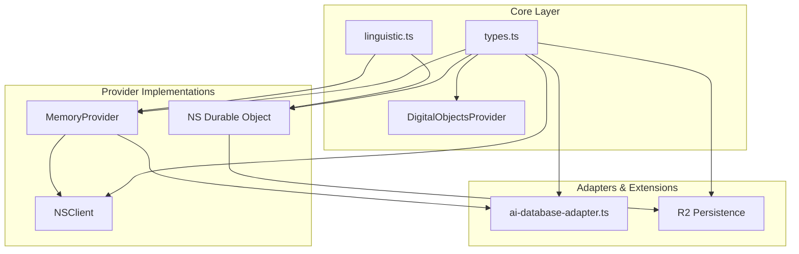

# Digital Objects Architecture Review

**Date**: 2026-01-15
**Package**: `packages/digital-objects`
**Version**: 0.1.0
**Reviewer**: Architecture Review (Claude Opus 4.5)
**Purpose**: Release readiness assessment

---

## Executive Summary

The `digital-objects` package presents a well-designed, linguistically-aware entity-graph storage system with a clear conceptual model. The architecture follows sound principles and provides meaningful abstractions. However, several concerns need addressing before production release, particularly around immutable actions, missing features, and scalability considerations.

**Overall Assessment**: **CONDITIONAL APPROVAL** - Ready for beta/preview release with documented limitations; requires additional work for production-grade deployment.

**Release Readiness Score**: 7.2/10

---

## Architecture Diagram

```
                              digital-objects Package
  +------------------------------------------------------------------------------+
  |                                                                              |
  |  +------------------------+      +------------------------+                 |
  |  |   Linguistic Layer     |      |    Types Layer         |                 |
  |  |  +------------------+  |      |  +------------------+  |                 |
  |  |  | deriveNoun()     |  |      |  | Noun             |  |                 |
  |  |  | deriveVerb()     |  |      |  | Verb             |  |                 |
  |  |  | pluralize()      |  |      |  | Thing<T>         |  |                 |
  |  |  | singularize()    |  |      |  | Action<T>        |  |                 |
  |  |  +------------------+  |      |  +------------------+  |                 |
  |  +------------------------+      +------------------------+                 |
  |              |                              |                                |
  |              v                              v                                |
  |  +-------------------------------------------------------------------+       |
  |  |                  DigitalObjectsProvider Interface                 |       |
  |  |  +--------------------+  +--------------------+  +--------------+ |       |
  |  |  | Nouns/Verbs        |  | Things (CRUD)      |  | Actions/Graph| |       |
  |  |  | defineNoun()       |  | create()           |  | perform()    | |       |
  |  |  | getNoun()          |  | get()              |  | getAction()  | |       |
  |  |  | listNouns()        |  | list()             |  | listActions()| |       |
  |  |  | defineVerb()       |  | find()             |  | related()    | |       |
  |  |  | getVerb()          |  | update()           |  | edges()      | |       |
  |  |  | listVerbs()        |  | delete()           |  |              | |       |
  |  |  +--------------------+  | search()           |  +--------------+ |       |
  |  |                          +--------------------+                   |       |
  |  +-------------------------------------------------------------------+       |
  |              ^                      ^                     ^                  |
  |              |                      |                     |                  |
  |  +-----------+----------+-----------+----------+----------+-----------+      |
  |  |                      |                      |                      |      |
  |  v                      v                      v                      v      |
  | +----------------+  +----------------+  +----------------+  +----------------+|
  | | MemoryProvider |  | NS (Durable    |  | NSClient       |  | DBProvider    ||
  | | (In-memory)    |  |   Object)      |  | (HTTP Client)  |  | Adapter       ||
  | | ~300 lines     |  | SQLite-backed  |  | Implements     |  | ai-database   ||
  | | Testing/Dev    |  | Multi-tenant   |  | Provider via   |  | compatibility ||
  | +----------------+  | Production     |  | HTTP           |  +----------------+|
  |        |            +----------------+  +----------------+         |         |
  |        |                    |                   |                  |         |
  +--------|--------------------|------------------------------------- |---------+
           |                    |                   |                  |
           v                    v                   v                  v
  +----------------+  +------------------+  +----------------+  +----------------+
  | In-Memory Maps |  | Cloudflare DO    |  | HTTP/JSON      |  | ai-database   |
  |                |  | SQLite Storage   |  | REST API       |  | DBProvider    |
  +----------------+  +------------------+  +----------------+  +----------------+
                              |
                              v
                      +----------------+
                      | R2 Persistence |
                      | - Snapshots    |
                      | - WAL          |
                      | - JSONL Export |
                      +----------------+
```

### Component Dependency Graph



---

## 1. Design Patterns Analysis

### Patterns Identified

| Pattern | Usage | Implementation Quality |
|---------|-------|----------------------|
| **Provider Pattern** | `DigitalObjectsProvider` interface | Excellent - Clean abstraction |
| **Factory Pattern** | `createMemoryProvider()`, `createNSClient()` | Good - Consistent API |
| **Adapter Pattern** | `createDBProviderAdapter()` | Good - Clear translation layer |
| **Repository Pattern** | Things CRUD operations | Partial - No Unit of Work |
| **Event Sourcing** | Actions as immutable events | Partial - No projections |
| **Graph Model** | Subject-Verb-Object relationships | Good - Clean edge model |

### Strengths

1. **Clean Provider Abstraction**: The `DigitalObjectsProvider` interface is well-designed, providing a consistent API across implementations (MemoryProvider, NS, NSClient).

2. **Linguistic Integration**: The automatic derivation of noun/verb forms is a unique and valuable feature that promotes consistency.

3. **Unified Action Model**: Combining events, graph edges, and audit trails into "Actions" is conceptually elegant and reduces complexity.

### Weaknesses

1. **Missing Command Pattern**: No abstraction for transactional operations or command batching.

2. **No Observer Pattern**: No built-in event subscription mechanism for reactive updates.

3. **Limited Query Builder**: No fluent query API for complex filtering/aggregation.

---

## 2. Separation of Concerns

### Layer Analysis

| Layer | Files | Responsibility | Coupling |
|-------|-------|---------------|----------|
| **Types** | `types.ts` | Domain models | None (pure types) |
| **Linguistic** | `linguistic.ts` | Word derivation | None (pure functions) |
| **Provider Interface** | `types.ts` | Contract | Low (interface only) |
| **Memory Implementation** | `memory-provider.ts` | In-memory storage | Low |
| **DO Implementation** | `ns.ts` | SQLite + HTTP API | Medium (CF types) |
| **HTTP Client** | `ns-client.ts` | Remote access | Low |
| **Persistence** | `r2-persistence.ts` | Backup/Restore | Medium (R2 types) |
| **Adapter** | `ai-database-adapter.ts` | Compatibility | Low |

### Assessment

**Grade: B+**

**Strengths**:
- Types and linguistic utilities are completely pure and reusable
- Provider implementations are well-isolated
- Clear boundary between interface and implementation

**Concerns**:
1. **NS.ts combines too much**: The `NS` class handles both storage AND HTTP routing (743 lines). The HTTP API layer should be separated from the storage provider.

2. **No separate query layer**: Filtering logic is duplicated between MemoryProvider and NS.

3. **R2 persistence depends on provider internals**: The persistence layer accesses data through the provider interface but knows about internal structure.

**Recommendation**: Extract HTTP routing from NS into a separate handler; create a shared query execution layer.

---

## 3. Provider Abstraction

### Interface Design

```typescript
interface DigitalObjectsProvider {
  // Nouns (5 methods)
  defineNoun(def: NounDefinition): Promise<Noun>
  getNoun(name: string): Promise<Noun | null>
  listNouns(): Promise<Noun[]>

  // Verbs (5 methods)
  defineVerb(def: VerbDefinition): Promise<Verb>
  getVerb(name: string): Promise<Verb | null>
  listVerbs(): Promise<Verb[]>

  // Things (7 methods)
  create<T>(noun: string, data: T, id?: string): Promise<Thing<T>>
  get<T>(id: string): Promise<Thing<T> | null>
  list<T>(noun: string, options?: ListOptions): Promise<Thing<T>[]>
  find<T>(noun: string, where: Partial<T>): Promise<Thing<T>[]>
  update<T>(id: string, data: Partial<T>): Promise<Thing<T>>
  delete(id: string): Promise<boolean>
  search<T>(query: string, options?: ListOptions): Promise<Thing<T>[]>

  // Actions (3 methods)
  perform<T>(verb: string, subject?: string, object?: string, data?: T): Promise<Action<T>>
  getAction<T>(id: string): Promise<Action<T> | null>
  listActions<T>(options?: ActionOptions): Promise<Action<T>[]>

  // Graph (2 methods)
  related<T>(id: string, verb?: string, direction?: 'out' | 'in' | 'both'): Promise<Thing<T>[]>
  edges<T>(id: string, verb?: string, direction?: 'out' | 'in' | 'both'): Promise<Action<T>[]>

  // Lifecycle (1 optional method)
  close?(): Promise<void>
}
```

### Assessment

**Grade: A-**

**Strengths**:
- Comprehensive CRUD operations
- Clean graph traversal API
- Consistent async/await pattern
- Good use of generics for type safety

**Concerns**:

1. **Missing batch operations**: No `createMany()`, `updateMany()`, `deleteMany()` for bulk operations.

2. **Inconsistent ID handling**:
   - `get()` takes only ID (no type check)
   - `list()` takes noun as first parameter
   - `delete()` takes only ID (ignores type)

3. **No upsert operation**: Common pattern missing from interface.

4. **No count/aggregate**: No way to get counts or aggregates without fetching all data.

5. **Missing transaction support**: No mechanism for atomic multi-operation transactions.

### Provider Implementation Comparison

| Feature | MemoryProvider | NS (Durable Object) | NSClient |
|---------|---------------|---------------------|----------|
| Lines of code | ~300 | ~730 | ~270 |
| Storage | Map | SQLite | HTTP delegate |
| Indexes | None | Yes (3) | N/A |
| Transactions | None | Implicit (single DO) | None |
| Query optimization | O(n) scan | SQL indexes | Depends on NS |
| Where clause | JS filter | JS filter | Client-side |

---

## 4. API Design

### Consistency Analysis

**Naming Conventions**:
- Method names: `camelCase` - Consistent
- Type names: `PascalCase` - Consistent
- Parameters: `camelCase` - Consistent

**Return Value Patterns**:
- Single item: `T | null` - Consistent
- Collections: `T[]` - Consistent
- Mutations: Return mutated object - Consistent
- Deletion: `boolean` - Consistent

**Parameter Order**:
| Operation | Pattern | Consistent? |
|-----------|---------|-------------|
| `get(id)` | ID only | No type param |
| `list(noun, options)` | Type, then options | Yes |
| `create(noun, data, id?)` | Type, data, optional ID | Yes |
| `update(id, data)` | ID, data (no type) | Inconsistent |
| `delete(id)` | ID only (no type) | Inconsistent |

### Assessment

**Grade: B**

**Strengths**:
- Intuitive naming that reflects the domain (nouns, verbs, things, actions)
- Good use of optional parameters
- Consistent return patterns

**Concerns**:

1. **Type parameter inconsistency**: Some methods require type, others don't. This leads to potential issues where you can update/delete a Thing without verifying its type.

2. **`perform()` signature is awkward**:
   ```typescript
   perform<T>(verb: string, subject?: string, object?: string, data?: T)
   ```
   Four optional-ish parameters make call sites unclear. Consider:
   ```typescript
   perform<T>(options: { verb: string; subject?: string; object?: string; data?: T })
   ```

3. **No fluent/chainable API**: Modern ORMs provide chainable queries:
   ```typescript
   // Current
   provider.list('Post', { where: { status: 'draft' }, orderBy: 'createdAt', limit: 10 })

   // Could be
   provider.posts.where({ status: 'draft' }).orderBy('createdAt').limit(10).list()
   ```

4. **Missing validation**: No runtime validation of inputs (e.g., verb existence before `perform()`).

---

## 5. Extensibility

### Extension Points

| Mechanism | Available | Notes |
|-----------|-----------|-------|
| Custom providers | Yes | Implement `DigitalObjectsProvider` |
| Schema validation | Partial | `schema` field exists but not enforced |
| Custom field types | Limited | Fixed `PrimitiveType` enum |
| Middleware/Hooks | No | No pre/post operation hooks |
| Custom serialization | No | JSON assumed everywhere |
| Plugin system | No | No formal plugin architecture |

### Assessment

**Grade: B-**

**Strengths**:
- Clean interface for custom providers
- Adapter pattern for ai-database compatibility
- Schema field allows metadata storage

**Concerns**:

1. **No validation hooks**: Cannot enforce schema at runtime:
   ```typescript
   // Schema says 'title' is required string
   await provider.create('Post', { title: 123 }) // No error
   ```

2. **Fixed primitive types**: Cannot add custom types like `uuid`, `slug`, `email`.

3. **No middleware layer**: Cannot add logging, metrics, or transformations.

4. **Closed relationship model**: The Action-based graph is elegant but inflexible:
   - No labeled edges beyond verb name
   - No edge weights
   - No hyperedges

5. **No inheritance/composition for types**: Cannot extend or compose noun definitions.

---

## 6. Scalability

### Memory Provider Scalability

| Aspect | Current | At 10K entities | At 1M entities |
|--------|---------|-----------------|----------------|
| Get by ID | O(1) | Fast | Fast |
| List all | O(n) | Acceptable | Slow |
| Find/Where | O(n) | Slow | Very slow |
| Search | O(n) | Slow | Very slow |
| Graph traversal | O(n) | Slow | Very slow |

### NS (Durable Object) Scalability

| Aspect | Current | Notes |
|--------|---------|-------|
| Get by ID | O(log n) | SQLite index |
| List by noun | O(log n) + O(k) | Indexed + result scan |
| Where clause | O(n) | Post-filter in JS |
| Search | O(n) | LIKE query, no FTS |
| Graph edges | O(log n) | Indexed on subject/object |

### Assessment

**Grade: C+**

**Critical Issues**:

1. **No pagination for related()/edges()**: These can return unbounded results.

2. **Where clauses not indexed**: All filtering happens in JavaScript after fetching:
   ```typescript
   // In NS.list():
   if (options?.where) {
     results = results.filter((t) => { /* JS filter */ })
   }
   ```

3. **No full-text search**: `search()` uses LIKE '%query%' which doesn't use indexes.

4. **Action queries can explode**: `listActions()` with no filters fetches all actions.

5. **R2 WAL not optimized**: Each WAL entry is a separate R2 object, expensive for many writes.

### Recommendations

1. **Add cursor-based pagination** for all list operations
2. **Implement JSON-based indexing** using SQLite's json_extract in WHERE clauses
3. **Add full-text search** using SQLite FTS5
4. **Batch WAL writes** using NDJSON in single R2 objects
5. **Add query result limits** (max 1000 default)

---

## 7. Consistency

### Naming Consistency Audit

| Category | Examples | Consistent? |
|----------|----------|-------------|
| Interface names | `DigitalObjectsProvider`, `DBProvider` | Yes |
| Method names | `defineNoun`, `defineVerb`, `create`, `get`, `list` | Yes |
| Parameter names | `noun`, `verb`, `thing`, `action` | Yes |
| File names | `types.ts`, `memory-provider.ts`, `ns.ts`, `ns-client.ts` | Yes |
| Export patterns | Named exports only | Yes |

### Structural Consistency Audit

| Aspect | MemoryProvider | NS | NSClient |
|--------|---------------|-----|----------|
| Constructor | None (factory) | DurableObjectState | Options object |
| Initialization | Implicit | `ensureInitialized()` | Implicit |
| Error handling | Throws | Throws | Throws |
| Null handling | Returns null | Returns null | Returns null |
| Date handling | Date objects | Date objects | Date objects |

### Assessment

**Grade: A-**

**Strengths**:
- Very consistent naming throughout
- Matching behavior across implementations
- Clean export structure

**Concerns**:

1. **Date serialization mismatch**: NS stores dates as integers, but returns Date objects. NSClient receives JSON dates (strings), but should convert to Date.

2. **Error message inconsistency**:
   - MemoryProvider: `"Thing not found: ${id}"`
   - NS: Same pattern but different context

3. **Optional close() method**: Should be required with no-op default for consistency.

---

## 8. Dependencies

### Direct Dependencies

```json
{
  "dependencies": {
    "@org.ai/types": "workspace:*"
  },
  "devDependencies": {
    "@cloudflare/workers-types": "^4.20240925.0",
    "wrangler": "^3.79.0",
    "vitest": "^2.0.0"
  },
  "peerDependencies": {
    "vitest": "^2.0.0"
  }
}
```

### Assessment

**Grade: A**

**Strengths**:
- Minimal runtime dependencies (only workspace types package)
- Platform types (Cloudflare) correctly in devDependencies
- Clean separation of concerns

**Concerns**:

1. **Missing optional peer dependency for ai-database**: The adapter imports types from itself but the ai-database package that would use it should be listed.

2. **No explicit Node.js version constraint**: Should specify engines field.

3. **Vitest in both peerDependencies and peerDependenciesMeta**: Correctly optional, but unusual pattern.

### Dependency Graph

```
digital-objects
    |
    +-- @org.ai/types (workspace)
    |       |
    |       +-- (internal types only)
    |
    +-- (dev) @cloudflare/workers-types
    +-- (dev) wrangler
    +-- (dev/peer) vitest
```

---

## Comparison to Industry Patterns

### vs. Prisma

| Aspect | digital-objects | Prisma |
|--------|-----------------|--------|
| Schema definition | Runtime `defineNoun()` | Build-time `.prisma` |
| Type safety | Generic `Thing<T>` | Generated types |
| Relationships | Action-based graph | Explicit relations |
| Migrations | None | Auto-generated |
| Query builder | Options object | Fluent API |

**Learning**: Consider generating TypeScript types from noun definitions.

### vs. Mongoose

| Aspect | digital-objects | Mongoose |
|--------|-----------------|----------|
| Schema | Optional, unenforced | Required, validated |
| Middleware | None | Pre/post hooks |
| Virtuals | None | Supported |
| Population | `related()` | `populate()` |

**Learning**: Add schema validation and middleware hooks.

### vs. TypeORM

| Aspect | digital-objects | TypeORM |
|--------|-----------------|---------|
| Entities | `Thing<T>` | Decorated classes |
| Repository | Provider | Repository pattern |
| Transactions | None | Full support |
| Migrations | R2 snapshots | SQL migrations |

**Learning**: Add transaction support and proper migration tooling.

### vs. Convex

| Aspect | digital-objects | Convex |
|--------|-----------------|--------|
| Real-time | None | Built-in |
| Functions | None | Server functions |
| Schema | Flexible | Strict |
| Indexing | Basic | Declarative |

**Learning**: Consider real-time subscription support.

### Unique Differentiators

1. **Linguistic awareness**: Auto-derivation of noun/verb forms is unique
2. **Unified action model**: Events + edges + audit in one concept
3. **Cloudflare-native**: First-class Durable Object support
4. **Multi-tenant by design**: Namespace isolation built-in

---

## Strengths Summary

1. **Conceptual Clarity**: The Noun/Verb/Thing/Action model is intuitive and maps well to real-world domains.

2. **Linguistic Intelligence**: Automatic derivation of singular/plural, verb conjugations is genuinely useful.

3. **Clean Provider Pattern**: Swappable implementations with consistent API.

4. **Cloudflare Integration**: Native Durable Object and R2 support for edge computing.

5. **Good Test Coverage**: Provider tests cover the contract well; adapter tests are comprehensive.

6. **Minimal Dependencies**: Runtime footprint is extremely light.

7. **Multi-tenant Ready**: Namespace isolation is built into the architecture.

8. **ai-database Compatibility**: Adapter provides bridge to larger ecosystem.

---

## Weaknesses/Concerns

### Critical (Must Fix for Production)

1. **Immutable Actions Cannot Be Deleted**: The `unrelate()` function is a no-op. This means:
   - Graph edges can never be removed
   - Data cannot be fully expunged for compliance (GDPR right to erasure)
   - Incorrect relationships cannot be corrected

2. **No Query Limits by Default**: `listActions()` and `related()` can return unbounded results, risking memory exhaustion.

3. **Where Clauses Not Indexed in NS**: All filtering happens post-fetch in JavaScript, making queries O(n).

### High Priority

4. **No Transaction Support**: Multi-step operations cannot be atomic.

5. **No Schema Validation**: Schema fields are stored but never enforced.

6. **Inconsistent Type Parameters**: `get()`, `update()`, `delete()` don't require type verification.

7. **NS.ts Is Too Large**: 730+ lines mixing storage and HTTP concerns.

### Medium Priority

8. **No Batch Operations**: Missing `createMany()`, `updateMany()`.

9. **No Count/Aggregate Functions**: Must fetch all data to count.

10. **No Full-Text Search**: Only LIKE-based search available.

11. **No Middleware/Hooks**: Cannot intercept operations for logging, validation, etc.

12. **Date Serialization in NSClient**: Receives JSON strings, should convert to Date objects.

### Low Priority

13. **No Fluent Query Builder**: Would improve DX.

14. **Fixed Primitive Types**: Cannot extend with custom types.

15. **No Real-time Subscriptions**: Consider for future roadmap.

---

## Recommendations

### Before Beta Release

1. **Add Action Deletion/Soft-Delete**:
   ```typescript
   interface DigitalObjectsProvider {
     // Add these methods
     deleteAction(id: string): Promise<boolean>
     softDeleteAction(id: string): Promise<Action>
   }
   ```

2. **Add Query Limits**:
   ```typescript
   const DEFAULT_LIMIT = 100
   const MAX_LIMIT = 1000

   async listActions<T>(options?: ActionOptions): Promise<Action<T>[]> {
     const limit = Math.min(options?.limit ?? DEFAULT_LIMIT, MAX_LIMIT)
     // ...
   }
   ```

3. **Separate NS HTTP Layer**:
   ```typescript
   // ns-storage.ts - Storage logic only
   export class NSStorage implements DigitalObjectsProvider { ... }

   // ns-handler.ts - HTTP routing
   export function handleRequest(storage: NSStorage, request: Request) { ... }

   // ns.ts - Durable Object entry point
   export class NS extends DurableObject {
     private storage = new NSStorage(this.ctx, this.env)
     async fetch(request: Request) {
       return handleRequest(this.storage, request)
     }
   }
   ```

### Before Production Release

4. **Add Schema Validation**:
   ```typescript
   async create<T>(noun: string, data: T, id?: string): Promise<Thing<T>> {
     const nounDef = await this.getNoun(noun)
     if (nounDef?.schema) {
       validateSchema(data, nounDef.schema) // Throws on invalid
     }
     // ...
   }
   ```

5. **Add SQL-Level Where Clauses in NS**:
   ```typescript
   // For simple equality checks, use json_extract
   if (options?.where) {
     for (const [key, value] of Object.entries(options.where)) {
       sql += ` AND json_extract(data, '$.${key}') = ?`
       params.push(JSON.stringify(value))
     }
   }
   ```

6. **Add Batch Operations**:
   ```typescript
   interface DigitalObjectsProvider {
     createMany<T>(noun: string, items: Array<{ data: T; id?: string }>): Promise<Thing<T>[]>
     updateMany(updates: Array<{ id: string; data: unknown }>): Promise<Thing[]>
     deleteMany(ids: string[]): Promise<number>
   }
   ```

### Future Enhancements

7. **Middleware System**:
   ```typescript
   interface Middleware {
     beforeCreate?(noun: string, data: unknown): unknown
     afterCreate?(thing: Thing): void
     // etc.
   }

   provider.use(loggingMiddleware)
   provider.use(validationMiddleware)
   ```

8. **Generated Types**:
   ```typescript
   // From defineNoun({ name: 'Post', schema: { title: 'string', body: 'markdown' } })
   // Generate:
   interface Post {
     title: string
     body: string
   }
   ```

9. **Full-Text Search**:
   ```typescript
   // In NS initialization
   this.sql.exec(`
     CREATE VIRTUAL TABLE IF NOT EXISTS things_fts
     USING fts5(id, noun, data, content='things', content_rowid='rowid')
   `)
   ```

---

## Test Coverage Analysis

### Current Test Files

| File | Lines | Test Cases | Coverage Focus |
|------|-------|------------|----------------|
| `provider.test.ts` | 224 | 23 | Contract testing |
| `ai-database-adapter.test.ts` | 564 | 40 | Adapter compatibility |
| `r2-persistence.test.ts` | (not read) | - | Backup/restore |

### Coverage Gaps

1. **No NS.ts tests**: The Durable Object implementation is untested.
2. **No linguistic.ts tests**: Edge cases in pluralization/conjugation not verified.
3. **No error path tests**: What happens on DB errors, network failures?
4. **No concurrent access tests**: Race conditions not explored.
5. **No performance tests**: No benchmarks or stress tests.

---

## Final Verdict

### Release Readiness by Use Case

| Use Case | Ready? | Notes |
|----------|--------|-------|
| Development/Testing | Yes | MemoryProvider works well |
| Internal Tools | Yes | With documented limitations |
| Beta/Preview | Yes | Good for early adopters |
| Production (low traffic) | Conditional | Needs query limits, action deletion |
| Production (high traffic) | No | Needs indexing, batching, FTS |
| Compliance-sensitive | No | Cannot delete actions for data expungement |

### Action Items for Release

**Must Have (Blockers)**:
- [ ] Add query result limits to prevent memory exhaustion
- [ ] Document the immutable action limitation prominently
- [ ] Add action deletion for compliance use cases

**Should Have**:
- [ ] Separate NS HTTP layer from storage
- [ ] Add SQL-level where clause filtering
- [ ] Add NSClient date deserialization fix

**Nice to Have**:
- [ ] Schema validation
- [ ] Batch operations
- [ ] Middleware hooks

---

## Appendix: File Summary

| File | Lines | Purpose |
|------|-------|---------|
| `types.ts` | 172 | Core type definitions |
| `memory-provider.ts` | 308 | In-memory implementation |
| `ns.ts` | 744 | Durable Object implementation |
| `ns-client.ts` | 272 | HTTP client for NS |
| `linguistic.ts` | 258 | Word derivation utilities |
| `ai-database-adapter.ts` | 187 | ai-database compatibility |
| `r2-persistence.ts` | 368 | Backup/restore to R2 |
| `index.ts` | 66 | Package exports |
| **Total** | **~2,375** | |

---

*Review completed 2026-01-15 by Claude Opus 4.5*
